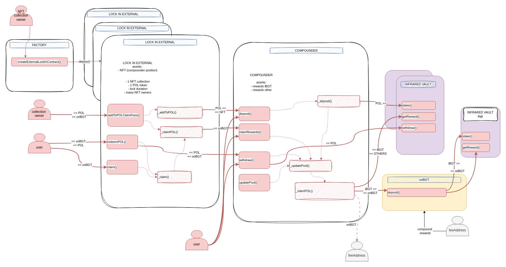
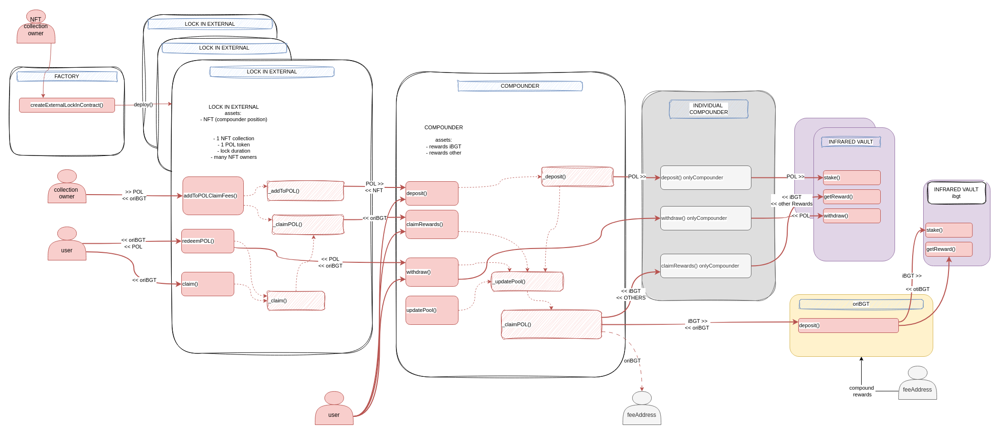

# LockIn security review

A time-boxed security review of the LockIn Compounder and LockInExternal contracts for [**LockIn XZY**](https://x.com/lockinxyz?s=21), focusing on smart contract security.

Author: [**Jacopod**](https://twitter.com/jacolansac), an independent security researcher.
Read [past security reviews](https://github.com/JacoboLansac/audits/blob/main/README.md).

## Findings Summary

| Finding                                                                                                                                               | Risk   | Description                                                                                                                                      | Response |
| :---------------------------------------------------------------------------------------------------------------------------------------------------- | :----- | :----------------------------------------------------------------------------------------------------------------------------------------------- | :------- |
| [[H-1]](<#h-1-an-attacker-can-cause-an-unfair-distribution-of-ibgt-among-pol-tokens-leaving-certain-depositors-with-0-returns>)                       | High   | An attacker can cause an unfair distribution of iBGT among POL tokens, leaving certain depositors with 0% returns                                 | ✅ Fixed  |
| [[M-1]](<#m-1-if-oribgt-is-paused-users-cant-withdraw-assets-or-claim-rewards-from-the-compounder>)                                                   | Medium | If oriBGT is paused, users can't withdraw assets or claim rewards from the Compounder                                                            | ✅ Fixed  |
| [[M-2]](<#m-2-in-lockinexternal-claim-and-redeempol-will-revert-for-burnable-collections-once-the-totalsupply-drops-below-the-number-of-redemptions>) | Medium | In LockInExternal, `claim()` and `redeemPOL()` will revert for burnable collections once the `totalSupply` drops below the number of redemptions | 🤝 Ackn.  |


## Low risk issues

| Finding                                                                                                                                             | Risk | Description                                                                                                                        | Response |
| :-------------------------------------------------------------------------------------------------------------------------------------------------- | :--- | :--------------------------------------------------------------------------------------------------------------------------------- | :------- |
| [[L-01]](<#l-01-changing-the-fee-applies-retroactive-taxation-to-accrued-rewards-in-the-infrared-vault-that-havent-been-compounded-yet-into-oribgt>) | Low  | Changing the fee applies retroactive taxation to accrued rewards in the Infrared Vault that haven't been compounded yet into oriBGT | 🤝 Ackn.  |
| [[L-02]](<#l-02-a-malicious-owner-of-the-compounder-can-steal-ibgt-rewards-from-users>)                                                             | Low  | A malicious owner of the Compounder can steal iBGT rewards from users                                                              | ✅ Fixed  |
| [[L-03]](<#l-03-misleading-output-variable-in-compounderdeposit>)                                                                                   | Low  | Misleading output variable in `Compounder.deposit()`                                                                               | ✅ Fixed  |
| [[L-04]](<#l-04-oribgt-donations-in-compounder_claimpol-wont-be-accounted-for-and-will-get-stuck-in-the-compounder-contract>)                           | Low  | OriBGT donations in `Compounder._claimPOL()` won't be accounted for and will get stuck in the Compounder contract                      | 🤝 Ackn.  |
| [[L-05]](<#l-05-uninformative-error-in-lockinexternalredeempol-doesnt-tell-the-caller-what-tokenids-are-not-meeting-the-requirements>)              | Low  | Uninformative error in `LockInExternal.redeemPOL()` doesn't tell the caller what tokenIds are not meeting the requirements         | ✅ Fixed  |
| [[L-06]](<#l-06-potential-balance-inflation-in-lockinexternalgetclaimablemultiple-when-maxforitem_-exceeds-contracts-balance-of-oribgt->)           | Low  | Potential balance Inflation in `LockInExternal.getClaimableMultiple()` when `maxForItem_` exceeds contract's balance of oriBGT     | ✅ Fixed  |
| [[L-07]](<#l-07-division-by-zero-error-in-lockinexternalgetpolperitem-when-the-full-collection-is-redeemed>)                                        | Low  | Division by zero error in `LockInExternal.getPOLPerItem()` when the full collection is redeemed                                    | ✅ Fixed  |
| [[L-08]](<#l-08-interface-mismatch-in-compounderdeposit-when-called-from-lockinexternal>)                                                           | Low  | Interface mismatch in `Compounder.deposit() when called from LockInExternal`                                                       | ✅ Fixed  |
| [[L-09]](<#l-09-rewards-received-from-the-compounder-may-not-match-the-internal-accounting-in-lockinexternal_claimpol>)                                 | Low  | Rewards received from the compounder may not match the internal accounting in `LockInExternal._claimPOL()`                             | ✅ Fixed  |
| [[L-10]](<#l-10-inconsistent-period-restriction-in-factorycreateexternallockincontract>)                                                            | Low  | Inconsistent period restriction in `Factory.createExternalLockInContract()`                                                        | ✅ Fixed  |
| [[L-11]](<#l-11-nfts-minted-after-a-lock-in-has-been-concluded-will-receive-the-same-pol-and-oribgt-as-initial-holders>)                          | Low  | NFTs minted after a lock-in has been concluded will receive the same POL and oriBGT as initial holders                           | 🤝 Ackn.  |


## Disclaimer

A smart contract security review can never verify the complete absence of vulnerabilities. This is a time and
resource-bound effort to find as many vulnerabilities as possible, but there is no guarantee that all issues will be found.

A security researcher holds no
responsibility for the findings provided in this document. A security review is not an endorsement of the underlying
business or product and can never be taken as a guarantee that the protocol is bug-free. This security review is focused
solely on the security aspects of the Solidity implementation of the contracts. Gas optimizations are not the main
focus, but significant inefficiencies will also be reported.

## Risk classification

| Severity           | Impact: High | Impact: Medium | Impact: Low |
| :----------------- | :----------: | :------------: | :---------: |
| Likelihood: High   |   Critical   |      High      |   Medium    |
| Likelihood: Medium |     High     |     Medium     |     Low     |
| Likelihood: Low    |    Medium    |      Low       |     Low     |

### Likelihood

- **High** - attack path is possible with reasonable assumptions that mimic on-chain conditions, and the cost of the
  attack is relatively low compared to the amount of funds that can be stolen or lost.
- **Medium** - only conditionally incentivized attack vector, but still relatively likely.
- **Low** - has too many or too unlikely assumptions, or requires a huge stake by the attacker with little or no
  incentive.

### Impact

- **High** - leads to a significant material loss of assets in the protocol or significantly harms a group of users.
- **Medium** - only a small amount of funds can be lost (such as leakage of value) or a core functionality of the
  protocol is affected.
- **Low** - can lead to unexpected behavior with some of the protocol's functionalities that are not so critical.

### Actions required by severity level

- **High/Critical** - client **must** fix the issue.
- **Medium** - client **should** fix the issue.
- **Low** - client **could** fix the issue.

## Scope

- **Main review:**
  - Start date: `2024-03-24`
  - End date: `2024-04-08`
  - Commit hash in scope:
    - [4c44ac2797c2b9143ce4b38972b9d55a989c53ce](https://github.com/4c44ac2797c2b9143ce4b38972b9d55a989c53ce)

- **Mitigation review**
  - Mitigation review delivery date: `2024-04-21`
  - Commit hash:
    - [10dea49476ff2c8e5bfc9e3bb23c032dbd4ae8bd](https://github.com/pending10dea49476ff2c8e5bfc9e3bb23c032dbd4ae8bd)


### Files in original scope

| Files in scope                                       | nSLOC   |
| ---------------------------------------------------- | ------- |
| contracts/Compounder.sol                             | 188     |
| contracts/NonFungiblePOL/external/LockInExternal.sol | 135     |
| contracts/NonFungiblePOL/external/Factory.sol        | 22      |
| **Total**                                            | **345** |


## Protocol Overview

At a high level, the project offers a way for NFT collection owners to show proof of compromise by allowing them to lock Proof of Liquidity tokens (POL) 
supported by [Infrared vaults](https://infrared.finance/vaults), which will then be redeemed by NFT holders. 
During this process, NFT holders will be able to claim yield generated in the form of oriBGT tokens. 

Internally, the iBGT rewards collected from the Infrared Vaults are deposited into 
Origami's [oriBGT vault](https://origami.finance/collections/berachain-collection/80094-0x69f1E971257419B1E9C405A553f252c64A29A30a/info). This vault provides a continuous compounding of iBGT, 
as the iBGT rewards are redeposited continuously in the iBGT Infrared Vault. 


## Architecture high-level review

The architecture is based on three contracts:
- The Compounder, which deposits POL tokens in valid InfraredVaults, and compounds the iBGT rewards by depositing in Origami's oriBGT vault
- The LockInExternal, which allows an NFT collection owner to lock POL tokens. This contract handles the mechanism of streaming `oriBGT` rewards to NFT owners and the "redemption" of NFTs for a share of the locked POL tokens.
- The Factory, which centralizes the deployment of LockInExternals and keeps track of them

Below is a graphical overview of the architecture from the point of view of function calls and funds flow:



NOTE: gas optimizations have not been pointed out, as the gas fees in Berachain are virtually negligible.

------------------------

## Updated architecture

Due to finding [[H-1]](<#h-1-an-attacker-can-cause-an-unfair-distribution-of-ibgt-among-pol-tokens-leaving-certain-depositors-with-0-returns>), the team re-designed the architecture of the system, adding the individual-compounder contract in between the Compounder and the infrared vaults. The new architecture looks as follows:




------------

# Findings

## High risk 

### [H-1] An attacker can cause an unfair distribution of iBGT among POL tokens, leaving certain depositors with 0% returns

#### Summary
- Contract: LockInCompounder
- Severity: med/high

The function `updatePool(_token)` calls `getReward()`, and then distributes the iBGT in the contract's balance, assuming all iBGT in the balance was collected by `getReward()`. 

However, the InfraredVault exposes a public function `getRewardForUser()` that allows any account to claim rewards on behalf of any other account.

An attacker can combine those two facts to distribute the iBGT earned by all POL tokens into a single token. 

#### Detailed description

In the Compounder, the function `updatePool(_token)` is meant to claim iBGT rewards for a given POL `_token`, and distribute it among the depositors of that given token. It does so by calling `InfraredVault.getReward()`, which sends iBGT to the compounder, and then updates `accoriBGTPerShare[_token]` with **all** the iBGT in the balance of the Compounder contract, assuming that all iBGT balance comes from the last `getReward()` call. 

```solidity

    function _updatePool(address _token) internal {
        
        // ...

        /// @audit _claimPOL takes all the iBGT in the contract's balance
>>>     uint256 _oriBGTReceived = _claimPOL(_token);

        if (_oriBGTReceived > 0) {
>>>         accoriBGTPerShare[_token] += (_oriBGTReceived * 1e18) / totalDeposited[_token];
        }
    }

    function _claimPOL(address _token) internal returns (uint256 _oriBGTReceived) {
        address _infraredVault = IInfrared(infrared).vaultRegistry(_token);
        uint256 iBGTToClaim_ = IInfraredVault(_infraredVault).earned(address(this), iBGT);

        if (iBGTToClaim_ > 0) {
            IInfraredVault(_infraredVault).getReward();
        }
        // @audit-issue when anyone calls InfrarredVault.getRewardsForUser() iBGT are transferred to this contract
        //  An attacker can collect iBGT from all vaults and make it look as if they were earned by this _token
>>>     uint256 iBGTBalance_ = IERC20(iBGT).balanceOf(address(this));

        if (iBGTBalance_ > 0) {
            IERC20(iBGT).approve(oriBGT, iBGTBalance_);
            _oriBGTReceived = IoriBGT(oriBGT).deposit(iBGTBalance_, address(this));
            uint256 fee_ = _oriBGTReceived * fee / BPS;
            _oriBGTReceived -= fee_;

            // ...
        }
        // ...
    }

```


However, the InfraredVault also exposes another function called `getRewardForUser()` which allows any account to claim rewards on behalf of other any other account (like for example, the Compounder). 

```solidity
    /// @inheritdoc IMultiRewards
    function getReward() public {
>>>     getRewardForUser(msg.sender);
    }

    /// @inheritdoc IMultiRewards
>>> function getRewardForUser(address _user) public nonReentrant updateReward(_user) {
        onReward();
        uint256 len = rewardTokens.length;
        for (uint256 i; i < len; i++) {
            address _rewardsToken = rewardTokens[i];
            uint256 reward = rewards[_user][_rewardsToken];
            // ...
        }
    }   
```

An attacker who has a position in the Compounder on a certain POL `_token` can benefit from the above function in the following way:

#### Attack scenario

Let's say an attacker has a position in the Compounder with a POL token called  `POL_A`. Other users have also deposited on other tokens `POL_B`, `POL_C`, which are each of them deposited in a different InfraredVault. The attacker can benefit as follows:

- The attacker calls `getRewardForUser()` in all InfraredVaults where the Compounder has a position (the vaults corresponding to `POL_A`, `POL_B`, `POL_C`). As a consequence, the iBGT rewards from all the vaults are sent to the Compounder. 
- The attacker calls `updatePool(POL_A)`. This will first call `getReward()` (inside `_claimPOL()`), but then will take the full iBGT balance in the contract and increase `accoriBGTPerShare[_token]` with it, as if it were all corresponding to `POL_A`.

End Result: all the iBGT rewards corresponding to `POL_B` and `POL_C` will be distributed only among depositors of `POL_A`.

Note that the impact is especially powerful when the total deposits of POL_A are small compared with the other POL tokens. For instance, if a new POL token is enabled in Infrared, the attacker can try to be the first one to deposit in the Compounder and perform the attack. This will direct **all** iBGT rewards from all vaults to his single deposit on the new POL token. 

Note also that the attacker could perform this attack continuously until it gets noticed, effectively yielding 0% returns to `POL_B` and `POL_C` holders, and a boosted reward for `POL_A`.

#### Impact: high

An attacker can unfairly allocate the iBGT rewards from all POL tokens into a single `_token`, profiting from this unfair distribution. Note that any other depositor of the `_token` chosen by the attacker would also benefit from it, but the depositors of any other POL token will get 0% yield from the compounder.  

- Probability: **high**
- Impact: **high/med**

#### Recommended mitigation

It is a non-trivial fix. The fact that InfraredVault allows any account to claim rewards on behalf of other accounts makes the "contract balance" the only valid way to split rewards between POL tokens. So, having all NFT positions from all POL tokens in the same contract makes it virtually impossible to distribute rewards fairly.

A potential solution would require a re-architecture of the Compounder such that each POL `_token` has its own Compounder. In this architecture, it would be irrelevant who claims iBGT on behalf of each Compounder contract: all iBGT in each contract can be safely distributed proportionally among depositors of that compounder.

#### Proof of code

A POC can be provided if needed. 


---------------


-----------------------------------------------------------------------


## Medium risk 

### [M-1] If oriBGT is paused, users can't withdraw assets or claim rewards from the Compounder
Function with the issue: `Compounder::_claimPOL()`

#### Description
If the oriBGT contract is paused, `oriBGT.deposit()` will revert. 
Every code path that attempts to compound iBGT by depositing into oriBGT, calling the internal `_claimPOL` will revert:

```solidity
function _claimPOL(address _token) internal returns (uint256 _oriBGTReceived) {
    // ... other code ...
    if (iBGTBalance_ > 0) {
        IERC20(iBGT).approve(oriBGT, iBGTBalance_);
        _oriBGTReceived = IoriBGT(oriBGT).deposit(iBGTBalance_, address(this));
        // ... rest of function
    }
}
```

#### Impact
When oriBGT is paused, the following external functions are affected:
- `deposit()` will revert: OK. 
- `claim()` will revert: Users can't collect accrued but unclaimed rewards
- `withdraw()` will revert: Users can't withdraw their deposited iBGT, which is problematic

#### Recommended fix

At a high level, the fix should allow users to:
- claim already accrued rewards without compounding with oriBGT
- withdraw their principal (token)

A suggested fix would be to pass an extra boolean argument to `_claimPOL` 
which would allow bypassing the `oriBGT.deposit()` call. The different external functions can choose how to deal with this parameter.
By default, they should always compound, but in emergencies, the users can skip it to achieve the two objectives above. 

```diff
- function _claimPOL(address _token) internal returns (uint256 _oriBGTReceived)
+ function _claimPOL(address _token, bool bypassOriBGTDeposit) internal returns (uint256 _oriBGTReceived)
```


### [M-2] In LockInExternal, `claim()` and `redeemPOL()` will revert for burnable collections once the `totalSupply` drops below the number of redemptions

Functions with the issue: 
- `LockInExternal::getLifetimeoriBGTPerItem()`
- `LockInExternal::getPOLPerItem()`

#### Description

There is no guarantee that the `totalSupply` of a collection is immutable. 
When the items of the collection can be burned, the `totalSupply` will decrease. This can become an issue for both of the functions below, 
which performs the following subtraction between `totalSupply` and `totalItemsRedeemedPOL`:

```solidity
    function getLifetimeoriBGTPerItem() public view returns (uint256 totaloriBGT_) {
        return (getPendingoriBGT() + totaloriBGTReceived - totaloriBGTClaimedByRedeemedItems)
>>>     / (IERC721Enumerable(collection).totalSupply() - totalItemsRedeemedPOL);
    }

    // ...

    function getPOLPerItem() public view returns (uint256 polPerItem_) {
        uint256 polDeposited_ = ICompounder(compounder).getPOLDeposited(POLTokenAddress, compounderId);
>>>     return polDeposited_ / (IERC721Enumerable(collection).totalSupply() - totalItemsRedeemedPOL);
    }
```

Example scenario:
- Intitial totalSupply = 100

Then at some point:
- Redeemed tokens = 80
- burned tokens = 25
- denominator = (100-25) - 80 = 75 - 80 --> **reverts with underflow**

The worst case scenario is when all items redeemed are also burned, as the functions above will revert when half the supply is redeemed & burned. 

#### Impact: medium

When the condition `totalSupply() < totalItemsRedeemedPOL` is true, then both of the functions above will revert with an underflow. Which means:
- All new `redeemPOL()` transactions will revert, so the users who haven't redeemed so far will lose their share of POL tokens
- All `claim()` transactions will revert for all users that have pending claims. 

#### Suggested mitigation

The fix is not trivial with the current architecture. Possible fixes are:

- Whitelisting only collections with a fixed `totalSupply`
- Enforcing depositing the NFTs in the LockIn balance, so that only the deposited NFTs are used in the divisor for the calculation of POL redemptions and rewards. NFTs would be returned to the users upon redemption. 

#### Team response

Collection owners are not incentivized to be malicious as they are depositing their POL for their communities. 
While collection owners may not act maliciously, they may create undesired situations by mistake. So the team committed to display appropriate warnings explaining the consequences of integrating with burnable collections


---------------------------

## Low risk

### [L-01] Changing the fee applies retroactive taxation to accrued rewards in the Infrared Vault that haven't been compounded yet into oriBGT

Function with the issue: `Compounder::setFee()`

#### Description

When updating the fee, any pending rewards that has not been yet claimed from Infrared Vaults and deposited into oriBGT will be affected by the new fee, even though it has been accrued in a previous period.

```solidity
function setFee(uint256 newFee_) external onlyOwner {
    require(newFee_ <= MAX_FEE, "Fee > MAX_FEE");
    fee = newFee_;
}
```

#### Recommended fix
The pending rewards should be accrued first to prevent retroactive taxation of already accrued yield. 
Call `_claimPOL()` before updating the fee to ensure rewards are properly accrued before retroactive taxation:

```diff
function setFee(uint256 newFee_) external onlyOwner {
    require(newFee_ <= MAX_FEE, "Fee > MAX_FEE");
+   _claimPOL();
    fee = newFee_;
}
```

#### Team response

With the new architecture of individual Compounders, the `_claimPOL()` accepts a `token` parameter that would require iterating through an unknown number of tokens. 
So the team decided to acknowledge the issue, with the expectation that the fees would never be increased but only decreased. 

### [L-02] A malicious owner of the Compounder can steal iBGT rewards from users

Issue type: Centralization
Function with the issue: `Compounder::withdrawStuckToken()`

#### Description

Anyone can call `InfraredVault.getRewardForUser(compounder)`, which will send the iBGT to the Compounder (but will not assign it as rewards for any POL token yet).
A malicious owner can call this function and later call `withdrawStuckToken(ibgt)`. This is possible because the function below has no restriction regarding `iBGT`:

```solidity
function withdrawStuckToken(address token_, address to_, uint256 amount_) external onlyOwner {
    require(token_ != oriBGT, "Can not withdraw oriBGT");
    IERC20(token_).transfer(to_, amount_);
}
```

#### Impact:
The probability is very low as it requires either a malicious owner (we can assume this is not the case) or a compromised private key of the Compounder owner address. 
Even if it happens, the likelihood is low, as the economic incentives are not huge, and the users won't lose their principal, only yield.

#### Recommended fix
Add a check to prevent `iBGT` withdrawal. Note that any potential iBGT donations to the compounder are not stuck and don't need to be rescued. 
as they can simply be compounded, because `_claimPOL()` compounds all ibgt in the Compounder balance.


```diff
function withdrawStuckToken(address token_, address to_, uint256 amount_) external onlyOwner {
    require(token_ != oriBGT, "Can not withdraw oriBGT");
+   require(token_ != iBGT, "Can not withdraw iBGT");
    IERC20(token_).transfer(to_, amount_);
}
```


### [L-03] Misleading output variable in `Compounder.deposit()`

Function with the issue: `Compounder::deposit()`

#### Description
The output variable `_pendingRewards` is misleading, as these rewards are transferred to `msg.sender` during execution.

```solidity
    function deposit(address _token, uint256 _nftId, uint256 _amount) external returns (uint256 _id, uint256 _pendingRewards)   {

        // ...

        if (_pendingRewards > 0) {
>>>         IERC20(oriBGT).transfer(msg.sender, _pendingRewards);
        }
    }
```

#### Impact: The integrating contracts can be misled, but the LockInExternal contract is not affected, as this output variable is not read except when the NFT is initialized (where pending rewards are correctly 0).

#### Recommended fix
Rename the output variable to better reflect its purpose:

```diff
- function deposit(address _token, uint256 _nftId, uint256 _amount) external returns (uint256 _id, uint256 _pendingRewards)
+ function deposit(address _token, uint256 _nftId, uint256 _amount) external returns (uint256 _id, uint256 _transferredRewards)
```

### [L-04] OriBGT donations in `Compounder._claimPOL()` won't be accounted for and will get stuck in the Compounder contract

Function with the issue: `Compounder::_claimPOL()`

#### Description
OriBGT donations are not accounted for in `_oriBGTReceived` as the function only accounts for OriBGT received at the `deposit()` call. Any donated oriBGT won't be accounted in the `accoriBGTPerShare` and therefore won't become claimable. 

```solidity
    function _claimPOL(address _token) internal returns (uint256 _oriBGTReceived) {
        // ...

        if (iBGTBalance_ > 0) {
            IERC20(iBGT).approve(oriBGT, iBGTBalance_);
>>>         _oriBGTReceived = IoriBGT(oriBGT).deposit(iBGTBalance_, address(this));
            uint256 fee_ = _oriBGTReceived * fee / BPS;
            _oriBGTReceived -= fee_;

            IERC20(oriBGT).transfer(feeAddress, fee_);
        }
    }

    function _updatePool(address _token) internal {
        if (block.number <= lastRewardBlock[_token]) {
            return;
        }

        if (totalDeposited[_token] == 0) {
            lastRewardBlock[_token] = block.number;
            return;
        }

>>>     uint256 _oriBGTReceived = _claimPOL(_token);

        if (_oriBGTReceived > 0) {
>>>         accoriBGTPerShare[_token] += (_oriBGTReceived * 1e18) / totalDeposited[_token];
        }
```


#### Impact: 
As oriBGT cannot be rescued with withdrawStuckToken(), the donated oriBGT will be locked in the contract and won't count as valid rewards. 

#### Recommended fix
Inside _claimPOL(), include any potential extra `oriBGT` balance that has been donated to the contract. This will be artificially added only to the current `token`, but that is better than letting them be stuck.

```diff
    function _claimPOL(address _token) internal returns (uint256 _oriBGTReceived) {
        // ...

        if (iBGTBalance_ > 0) {
            IERC20(iBGT).approve(oriBGT, iBGTBalance_);
-           _oriBGTReceived = IoriBGT(oriBGT).deposit(iBGTBalance_, address(this));
+           IoriBGT(oriBGT).deposit(iBGTBalance_, address(this));
+           // This includes the recent deposit plus potential donations
+           uint256 _oriBGTReceived = IoriBGT(oriBGT).balanceOf(address(this));

            uint256 fee_ = _oriBGTReceived * fee / BPS;
            _oriBGTReceived -= fee_;

            IERC20(oriBGT).transfer(feeAddress, fee_);
        }
    }

```

### [L-05] Uninformative error in `LockInExternal.redeemPOL()` doesn't tell the caller what tokenIds are not meeting the requirements

Function with the issue: `LockInExternal::redeemPOL()`

#### Description
When the ownership requirement reverts, the caller won't know which tokenId has failed.

```solidity
    require(IERC721(collection).ownerOf(id_[i]) == msg.sender, "Not owner of item");
```

#### Recommended fix
Use a custom error with the tokenId as a parameter:

```diff
+ error NotOwnerOfItem(uint256 tokenId);
for (uint256 i; i < id_.length; ++i) {
-   require(IERC721(collection).ownerOf(id_[i]) == msg.sender, "Not owner of item");
+   if (IERC721(collection).ownerOf(id_[i]) != msg.sender) {
+       revert NotOwnerOfItem(id_[i]);
+   }
}
```

### [L-06] Potential balance Inflation in `LockInExternal.getClaimableMultiple()` when `maxForItem_` exceeds contract's balance of oriBGT 
Function with the issue: `LockInExternal::getClaimableMultiple()`

#### Description

The function `getClaimableMultiple()` calls iteratively to `getClaimable()`. This function has a safety check where, if the `maxForItem` is higher than the LockIn balance, it will only return the balance:

```solidity
    function getClaimable(uint256 id_) public view returns (uint256 claimableoriBGT_) {
        // ...
        uint256 maxForItem_ = getLifetimeoriBGTPerItem() - oriBGTClaimed[id_];
        uint256 oriBGTBalance_ = IERC20(oriBGT).balanceOf(address(this)) + getPendingoriBGT();

>>>     if (maxForItem_ <= oriBGTBalance_) return maxForItem_;

        return oriBGTBalance_;
    }
```

When such an unlikely scenario happens, then `getClaimableMultiple()` will return an artificially high value, as it will return the `oriBGTbalance_` times the array length.

#### Recommended fix
Athought this case shouldn't even be considered in getClaimable(), if it is considered there, it should be handled in the same way in `getClaimableMultiple()`, only allowing to return maximum the contract's balance.

```diff
function getClaimableMultiple(uint256[] calldata id_) external view returns (uint256 claimableoriBGT_) {
+   uint256 contractBalance = IERC20(oriBGT).balanceOf(address(this));
    for (uint256 i; i < id_.length; i++) {
        claimableoriBGT_ += getClaimable(id_[i]);
    }
+   if (claimableoriBGT_ > contractBalance) {
+       claimableoriBGT_ = contractBalance;
+   }
}
```

### [L-07] Division by zero error in `LockInExternal.getPOLPerItem()` when the full collection is redeemed
Function with the issue: `LockInExternal::getPOLPerItem()`

#### Description
When all items are redeemed, the function `getPOLPerItem()` will revert with division by zero, because 
`IERC721Enumerable(collection).totalSupply() = totalItemsRedeemedPOL`:

```solidity
    function getPOLPerItem() public view returns (uint256 polPerItem_) {
        uint256 polDeposited_ = ICompounder(compounder).getPOLDeposited(POLTokenAddress, compounderId);
>>>     return polDeposited_ / (IERC721Enumerable(collection).totalSupply() - totalItemsRedeemedPOL);
    }
```

#### Impact

Even though this function is used in critical exposed methods (redeemPOL), the bug only uncovers when all items are redeemed, so at that point, the bug is irrelevant. 
The only impact may be broken frontend integrations if anything. 

#### Recommended fix
Add a check for zero remaining items:

```diff
function getPOLPerItem() public view returns (uint256 polPerItem_) {
    uint256 polDeposited_ = ICompounder(compounder).getPOLDeposited(POLTokenAddress, compounderId);
-   return polDeposited_ / (IERC721Enumerable(collection).totalSupply() - totalItemsRedeemedPOL);
+   uint256 remainingItems = IERC721Enumerable(collection).totalSupply() - totalItemsRedeemedPOL;
+   if (remainingItems == 0) {
+       return 0;
+   }
+   return polDeposited_ / remainingItems;
}
```

#### Team response
The team applied the suggested solution above. 

While the solution above avoids reverts, there is an edge case in which, when there is one pending item to be redeemed but the collection is burnable, someone else can burn one item, causing the last share of POL to be locked in the contract. 

The team is OK with this edge case, as the frontend will warn against burnable collections.


### [L-08] Interface mismatch in `Compounder.deposit() when called from LockInExternal`

Functions with the issue: 
- `LockInExternal::_addToPOL()`
- `ICompounder.deposit()`

#### Description

The `ICompounder.deposit()` interface function only has one output:
```solidity
    function deposit(address _token, uint256 _nftId, uint256 _amount) external returns (uint256 _id);
```
And this is how it is used in the LockInExternal:
```solidity
compounderId = ICompounder(compounder).deposit(POLTokenAddress, 0, POLTokenBalance_);
```
However, the the `Compounder.deposit()` function has two outputs: `(uint256 _id, uint256 _pendingRewards)`. 
When `LockInExternal._addToPOL()` calls `Compounder.deposit()`, the pending rewards output is ignored. 

#### Recommended fix
Update the ICompounder interface and the usages of the compounder to get both values


### [L-09] Rewards received from the compounder may not match the internal accounting in `LockInExternal._claimPOL()`

Function with the issue: `LockInExternal::_claimPOL()`

#### Description

The output from `Compounder.getPendingRewards()` doesn't necessarily match the actual amount of oriBGT that will be received when calling claimRewards().

These two values can differ when the total calculated rewards exceed the `oriBGT` balance of the Compounder contract. This can only happen due to bad accounting in the Compounder, the Compounder tries to mitigate the issue by only returning up to the contract balance. 

However, if we don't want that accounting error to spread to the LockIn contract, then this function should not use the output from getPendingRewards, but it the one from compounder.claimRewards() instead.

#### Impact: 
The totaloriBGTReceived will be increased by a higher amount than what was received. The probability of this happening is very low, since it would mean a significant accounting error in the Compounder.

#### Recommended fix
Use the output from `claimRewards()` instead:

```diff
    function _claimPOL() internal {
        address[] memory _arr = new address[](1);
        _arr[0] = POLTokenAddress;
-       uint256 oriBGTReceived_ = ICompounder(compounder).getPendingRewards(_arr, compounderId);
+       uint256 oriBGTPending_ = ICompounder(compounder).getPendingRewards(_arr, compounderId);
-       if (oriBGTReceived_ > 0) {
+       if (oriBGTPending_ > 0) {
-           ICompounder(compounder).claimRewards(_arr, compounderId);
+           uint256 oriBGTReceived_ = ICompounder(compounder).claimRewards(_arr, compounderId);
            totaloriBGTReceived += oriBGTReceived_;
            emit oriBGTReceived(oriBGTReceived_);
        }
    }
```

### [L-10] Inconsistent period restriction in `Factory.createExternalLockInContract()`
Function with the issue: `Factory::createExternalLockInContract()`

#### Description
The following period restriction is only enforced in the factory, not in the lock-in contract:

```solidity
require(timeLockedIn_ > 30 days, "Must LockIn for at already 30 days");
```

#### Impact:
Users can deploy instances of LockInExternal with much shorter periods than 30 days. 

#### Recommended fix
Add the same restriction to the lock-in contract if the time restriction is relevant:

```diff
// In ExternalTimeLockInNonFungiblePOL.sol
+ require(timeLockedIn_ > 30 days, "Must LockIn for at least 30 days");
```


### [L-11] NFTs minted after a lock-in has been concluded will receive the same POL and oriBGT as initial holders
Functions with the issue: 
- `LockInExternal::getLifetimeoriBGTPerItem()`
- `LockInExternal::getPOLPerItem()`

#### Description

Both functions above share the underlying assumption that totalSupply is immutable once the collection is minted out. 
However, this assumption is not guaranteed, and some collections may allow mints even after the lock-in has been completed. 

When new NFTs are minted, the oriBGT rewards and the POL allocation get diluted, 
as the newly minted assets are entitled to the same amounts af the assets that were minted before the LockIn was created.


```solidity
    function getLifetimeoriBGTPerItem() public view returns (uint256 totaloriBGT_) {
        return (getPendingoriBGT() + totaloriBGTReceived - totaloriBGTClaimedByRedeemedItems)
>>>     / (IERC721Enumerable(collection).totalSupply() - totalItemsRedeemedPOL);
}

    function getPOLPerItem() public view returns (uint256 polPerItem_) {
        uint256 polDeposited_ = ICompounder(compounder).getPOLDeposited(POLTokenAddress, compounderId);
>>>     return polDeposited_ / (IERC721Enumerable(collection).totalSupply() - totalItemsRedeemedPOL);
    }
```

#### Impact: medium/low

- An unfair situation is created where minting before the lock-in has no benefits compared to minting after the lock-in is completed.
- A structure of wrong incentives is created when users can choose when to mint, as no one has incentives to mint before the lock-in is created, because their POL allocation and rewards can get diluted later.

#### Suggested Fix

The fix is not straightforward, and the team may simply decide to acknowledge this issue and think of rewards/POL dilution as a feature. Alternatively:

- Whitelisting only collections with a fixed `totalSupply`
- Enforcing depositing the NFTs in the LockIn, so that only the deposited NFTs are used in the divisor for the calculation of POL redemptions and rewards
- Caching the supply and implementing an emergency mechanism if it changes (because some items are minted). I don't like this one too much


#### The end
