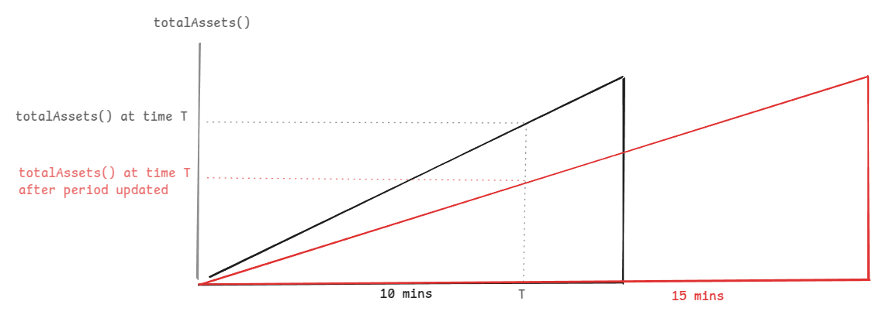

# Origami oriBGT (V2)- Security review

A time-boxed security review of OriBGT for [**Origami Finance**](https://origami.finance/), with a focus on smart contract security and gas optimizations.

**Author**: [**Jacopod**](https://twitter.com/jacolansac), an independent security researcher.
See [other security reviews here](https://github.com/JacoboLansac/audits/blob/main/README.md).

## Findings Summary

| Finding | Risk | Description | Response |
| :--- | :--- | :--- | :--- |
| [[L-1]](<#m-1-updating-reservesvestingduration-during-an-active-vesting-period-will-step-change-the-vault-share-price>) | Medium | Updating `reservesVestingDuration` during an active vesting period will step-change the vault share price | ✅ fixed  |

### Context

Note: a first architecture of oriBGT was implemented before, and was reviewed in a [previous security audit](oriBGT-audit-report.md). As a result of some findings, the team responsibly decided to re-architecture the manager contract for safety, and this report addresses this V2 of oriBGT. 


## Disclaimer

_A smart contract security review can never verify the complete absence of vulnerabilities. This is a time and
resource-bound effort to find as many vulnerabilities as possible, but there is no guarantee that all issues will be
found. A security researcher holds no
responsibility for the findings provided in this document. A security review is not an endorsement of the underlying
business or product and can never be taken as a guarantee that the protocol is bug-free. This security review is focused
solely on the security aspects of the Solidity implementation of the contracts. Gas optimizations are not the main
focus, but significant inefficiencies will also be reported._

## Risk classification

| Severity           | Impact: High | Impact: Medium | Impact: Low |
| :----------------- | :----------: | :------------: | :---------: |
| Likelihood: High   |   Critical   |      High      |   Medium    |
| Likelihood: Medium |     High     |     Medium     |     Low     |
| Likelihood: Low    |    Medium    |      Low       |     Low     |

### Likelihood

- **High** - attack path is possible with reasonable assumptions that mimic on-chain conditions and the cost of the
  attack is relatively low to the amount of funds that can be stolen or lost.
- **Medium** - only conditionally incentivized attack vector, but still relatively likely.
- **Low** - has too many or too unlikely assumptions or requires a huge stake by the attacker with little or no
  incentive.

### Impact

- **High** - leads to a significant material loss of assets in the protocol or significantly harms a group of users.
- **Medium** - only a small amount of funds can be lost (such as leakage of value) or a core functionality of the
  protocol is affected.
- **Low** - can lead to unexpected behavior with some of the protocol's functionalities that are not so critical.

### Actions required by severity level

- **High/Critical** - client **must** fix the issue.
- **Medium** - client **should** fix the issue.
- **Low** - client **could** fix the issue.

## Scope

- **Re-architecture review**
  - Mitigation review delivery date: `2025-03-13`
  - Commit hash: [fc15af4dcd78df31d7d44f1b7d4d345224c09bd6](https://github.com/TempleDAO/origami/tree/fc15af4dcd78df31d7d44f1b7d4d345224c09bd6)

### Files in original scope

| Contract path                                                             | nSloc | core changes |
| ------------------------------------------------------------------------- | ----- | ------------ |
| `contracts/common/swappers/OrigamiSwapperWithCallback.sol`                | 34    | <<<<<<       |
| `contracts/investments/OrigamiDelegated4626Vault.sol`                     | 72    | <<<<<<       |
| `contracts/common/OrigamiErc4626.sol`                                     | 282   |
| `contracts/investments/infrared/OrigamiInfraredVaultManager.sol`          | 212   | <<<<<<       |


## Protocol Overview

Users deposit assets (iBGT) into the oriBGT vault and receive oriBGT shares in exchange. The iBGT tokens are staked into an Infrared vault in exchange for rewards, that are initially given in the form of HONEY, but can eventually be given in other tokens, included iBGT (the vault asset). 

The reward tokens are sent to the swapper, that swaps them for iBGT to be staked again in the Infrarred Vault. 


## Architecture high level review

The architecture of oriBGT V1 suffered from the fact that anybody could claim rewards from the Infrared vault on behalf of oriBGT vault. 

The new architecture was simplified by relying on a simple assumption: any asset (or token) held by the manager contract is considered either a reward or a donation, which should increase the vault share price, and therefore is subject to a fee. 

With that assumption, any non-asset held can be converted into assets, and any assets can be reinvested into the Infrared vault, taking a performance fee before doing so. With this simplified assumptions, it doesn't matter who claims rewards on behalf of the vault or who donates assets/tokens to the vault. 


Note: Some vesting mechanics are introduced to avoid step-jumps in share prices. 

# Findings

## High risk

No high-risk issues found. 

## Medium risk

No medium-risk issues found. 

## Low risk

### [L-1] Updating `reservesVestingDuration` during an active vesting period will step-change the vault share price

- Severity: **medium**
- Contract: **OrigamiInfraredVaultManager**

#### Summary

The share price is calculated using `totalAssets()`. This calculates it as total assets deposited in `InfrarredVault`, minus the `unvested` amount. 
The `unvested` amount is calculated using a linear dripping release that depends on the `reservesVestingDuration`. 

The function `setReservesVestingDuration()` allows changing the `reservesVestingDuration` at any time. 

When `reservesVestingDuration` is updated in the middle of an active vesting period, the linear release accounting breaks:
- If the updated duration is longer than the original, the `totalAssets()` suddenly drops (slightly), which makes the share price drop as well.
- If the updated duration is shorter than the original, the opposite happens. 

Obviously, the share price should not be affected by a change in configuration. 
Moreover, the share price should not decrease, as OriBGT is a compounding vault, which shares should be backed up by an ever increasing amount of iBGT.

NOTE: This is temporary. Accounting goes back to normal after the broken vesting period is finished. So it would only affect users exiting during this broken period. 

#### Detailed description

Here is a rough example of how the `totalAssets()` drops by 1/3 when the vesting duration is increased 50%. 




`OrigamiERC4626.sol` uses `totalAssets()` to calculate share prices:
```solidity
    function _convertToShares(uint256 assets, OrigamiMath.Rounding rounding) internal view virtual returns (uint256) {
>>>     return assets.mulDiv(totalSupply() + _assetsToSharesScalar, totalAssets() + 1, rounding);
    }

    function _convertToAssets(uint256 shares, OrigamiMath.Rounding rounding) internal view virtual returns (uint256) {
>>>     return shares.mulDiv(totalAssets() + 1, totalSupply() + _assetsToSharesScalar, rounding);
    }
```

`OrigamiDelegatedERC4626.sol` overrides `totalAssets()`, asking the manager:
```solidity
    function totalAssets() public view virtual override(IERC4626, OrigamiErc4626) returns (uint256) {
        return _manager.totalAssets();
    }
```

And the manager, calculates the assets as the `stakedAssets()` (current staked balance at infrarred) minus the `totalUnvested`. 
```solidity
    function totalAssets() external view override returns (uint256 totalManagedAssets) {
        //ok totalAssets does not include the reinvested assets right away, but only after they have been vested. 
        //similarly, the assets that are in futureVestingReserves are neither included until next period

        // Total assets = staked amount - unvested rewards - any future period (yet to start vesting) reserves
        (, uint256 unvested) = _vestingStatus();
        // todo review this part 
        uint256 totalUnvested = unvested + futureVestingReserves;
>>>     uint256 totalStaked = stakedAssets();
        // Will have more staked than what is unvested, but floor to 0 just in case
        unchecked {
>>>         return totalStaked > totalUnvested ? totalStaked - totalUnvested : 0;
        }
    }
```

`totalUnvested` above is read from `_vestingStatus()`, which reads the `reservesVestingDuration` for the linear interpolation of how much has been vested.

```solidity
    function _vestingStatus() private view returns (uint256 vested, uint256 unvested) {
        // review reservesVestingDuration can be updated in `setReservesVestingDuration` ... make sure it cannot be set while a vesting period is active
>>>     uint48 vestingDuration = reservesVestingDuration;
        uint48 secsSinceLastCheckpoint;
        // review mirror the logic in _checkpointPendingReserves
        unchecked {
            secsSinceLastCheckpoint = uint48(block.timestamp) - lastVestingCheckpoint;
        }

        // The whole amount has been accrued (vested but not yet added to `vestedReserves`) 
        // if the time since the last checkpoint has passed the vesting duration
        uint256 totalPending = vestingReserves;
        vested = (secsSinceLastCheckpoint >= vestingDuration)
            ? totalPending
>>>         : totalPending.mulDiv(secsSinceLastCheckpoint, vestingDuration, OrigamiMath.Rounding.ROUND_DOWN);

        unchecked {
            unvested = totalPending - vested;
        }
    }
```

Lastly, `setReservesVestingDuration()` doesn't check if the current vesting period has finished. 
```solidity
    function setReservesVestingDuration(uint48 durationInSeconds) external override onlyElevatedAccess {
        // @audit-issue [MED, REPORTED] updating `reservesVestingDuration` while a vesting period is active causes a step jump in totalAssets, and therefore in share prices 
        if (durationInSeconds > _MAX_VESTING_DURATION) revert CommonEventsAndErrors.InvalidParam();
        emit RewardsVestingDurationSet(durationInSeconds);
        reservesVestingDuration = durationInSeconds;
    }
```

Therefore, updating `reservesVestingDuration` changes the vested/unvested amount, affecting the `totalAssets()`, affecting the share price.

#### Impact: medium

- Probability: the probability of updating the `reservesVestingDuration` is low, as probably it is not even intended to be changed. Also, the probability of it happening during a vesting period is not so high, as it would require that bots are constantly resetting the period as soon as they can. Furthermore, users would only be affected if they exited positions during the singular vesting period when the vesting duration was changed. Once this period is past, accounting goes back to normal. 

- Impact: reducing the share price temporarily can only be considered a temporary loss of yield (of a small amount). 

I can only label this as a medium, and not the most important medium in the world. 

#### Mitigation

1. Make the `reservesVestingDuration` as a constant and don't allow modifications
2. Only allow modifications when the vesting period is finished. One could argue that then the `setReservesVestingDuration()` can be DOS by always resetting the vesting period... but I don't see enough incentives for an attacker to consider it a problem. 

```diff
    function setReservesVestingDuration(uint48 durationInSeconds) external override onlyElevatedAccess {
        if (durationInSeconds > _MAX_VESTING_DURATION) revert CommonEventsAndErrors.InvalidParam();

+       uint48 secsSinceLastCheckpoint = uint48(block.timestamp) - lastVestingCheckpoint;
+       if (secsSinceLastCheckpoint < reservesVestingDuration) revert VestingPeriodNotFinished();

        if (secsSinceLastCheckpoint < reservesVestingDuration) {
        emit RewardsVestingDurationSet(durationInSeconds);
        reservesVestingDuration = durationInSeconds;
    }
```

#### Proof of code

This can be pasted at the end of `origami/apps/protocol/test/foundry/unit/investments/infrared/OrigamiIBGTVault.t.sol`:

```solidity
import {console} from "lib/forge-std/src/Test.sol";

contract TestOriBgtProofOfCodes is OrigamiIBGTVaultTestBase {

    function test_setReservesVestingDuration_breaksSharePrice() public {
        deposit(alice, 1000e18);
        // Skip time to accumulate rewards
        skip(1 weeks);
        // Harvest rewards which sends HONEY to the compounding swapper
        // Mock that it's already received the iBGT tokens back form the swapper.
        deal(address(asset), address(manager), 100e18);
        manager.harvestRewards(address(0)); // receiver is unused
        // Half way through the drip (in the middle of vestingDuration)
        skip(5 minutes); 

        /// here the test starts
        // then the vestingDurationPeriod is changed
        uint48 initialVestingDuration = manager.reservesVestingDuration();
        uint256 initialSharePrice = vault.previewDeposit(1e18);

        // extend the vesting duration to double the initial time
        vm.prank(origamiMultisig);
        manager.setReservesVestingDuration(2 * initialVestingDuration);
        
        // updating the vesting duration should have no impact whatsoever on the share price
        // however, as this is not the case, this will revert
        assertEq(initialSharePrice, vault.previewDeposit(1e18), "Vault share price has changed after changing the vesting duration");
    }
}
```

#### Team response

The team decided to fix the `reservesVestingDuration` to 10 minutes and remove the `setReservesVestingDuration()` function. 