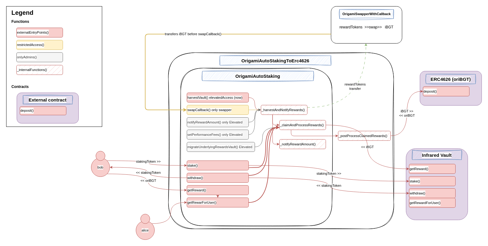
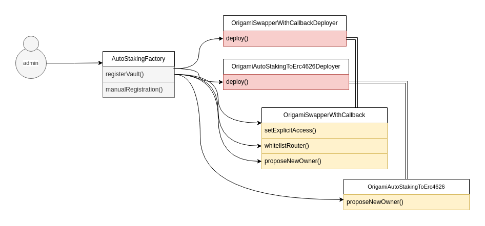

# Origami - AutoStaking security review

A time-boxed security review of **Origami AutoStaking** for [**Origami**](https://x.com/origami_fi), with a focus on smart contract security.

Author: [**Jacopod**](https://twitter.com/jacolansac), an independent security researcher.
Read [past security reviews](https://github.com/JacoboLansac/audits/blob/main/README.md).

## Findings Summary

| Finding | Risk | Description | Response |
| :--- | :--- | :--- | :--- |
| [[M-1]](<#m-1-if-oribgt-is-paused-users-cannot-withdraw-their-principal-or-claim-rewards-from-autostaking-vaults>) | Medium | If oriBGT is paused, users cannot withdraw their principal or claim rewards from AutoStaking vaults | ✅ Fixed |
| [[L-1]](<#l-1-users-cant-claim-their-rewards-if-one-of-the-reward-tokens-doesnt-return-a-boolean-on-transfer->) | Low | Users can't claim their rewards if one of the reward tokens doesn't return a boolean on transfer  | ✅ Fixed |
| [[L-2]](<#l-2-the-function-migrateunderlyingrewardsvault-gives-a-significant-power-to-the-contract-owner>) | Low | The function `migrateUnderlyingRewardsVault()` gives a significant power to the contract owner | ✅ Fixed |

A couple of informational issues are at the bottom of the report, not worth including them in the table. 

## Disclaimer

A smart contract security review can never verify the complete absence of vulnerabilities. This is a time and
resource-bound effort to find as many vulnerabilities as possible, but there is no guarantee that all issues will be
found.
A security researcher holds no
responsibility for the findings provided in this document. A security review is not an endorsement of the underlying
business or product and can never be taken as a guarantee that the protocol is bug-free. This security review is focused
solely on the security aspects of the Solidity implementation of the contracts. Gas optimizations are not the main
focus, but significant inefficiencies will also be reported.

## Risk classification

| Severity           | Impact: High | Impact: Medium | Impact: Low |
| :----------------- | :----------: | :------------: | :---------: |
| Likelihood: High   |   Critical   |      High      |   Medium    |
| Likelihood: Medium |     High     |     Medium     |     Low     |
| Likelihood: Low    |    Medium    |      Low       |     Low     |

### Likelihood

- **High** - attack path is possible with reasonable assumptions that mimic on-chain conditions and the cost of the
  attack is relatively low to the amount of funds that can be stolen or lost.
- **Medium** - only conditionally incentivized attack vector, but still relatively likely.
- **Low** - has too many or too unlikely assumptions or requires a huge stake by the attacker with little or no
  incentive.

### Impact

- **High** - leads to a significant material loss of assets in the protocol or significantly harms a group of users.
- **Medium** - only a small amount of funds can be lost (such as leakage of value) or a core functionality of the
  protocol is affected.
- **Low** - can lead to unexpected behavior with some of the protocol's functionalities that are not so critical.

### Actions required by severity level

- **High/Critical** - client **must** fix the issue.
- **Medium** - client **should** fix the issue.
- **Low** - client **could** fix the issue.

## Scope

- **Main review:**
  - Start date: `2025-04-24`
  - End date: `2025-05-13`
  - Effective total time: `19 hours`
  - Commit hash in scope:
    - [0b0c5ae1833ad30965909f6f3f405c532a07dd16](https://github.com/TempleDAO/origami/pull/1532/commits/0b0c5ae1833ad30965909f6f3f405c532a07dd16)

- **Mitigation review**
  - Mitigation review delivery date: `2025-05-14`
  - Commit hash:
    - [3d68df9ff83708305e8a606f0de6a65e6893f0b8](https://github.com/TempleDAO/origami/pull/1532/commits/3d68df9ff83708305e8a606f0de6a65e6893f0b8)

### Files in original scope

| Files in scope                                                                       | nSLOC   |
| ------------------------------------------------------------------------------------ | ------- |
| `contracts/factories/staking/OrigamiAutoStakingFactory.sol`                          | 105     |
| `contracts/factories/staking/OrigamiAutoStakingToErc4626Deployer.sol`                | 26      |
| `contracts/factories/swappers/OrigamiSwapperWithCallbackDeployer.sol`                | 7       |
| `contracts/investments/staking/OrigamiAutoStakingToErc4626.sol`                      | 28      |
| `contracts/investments/staking/OrigamiAutoStaking.sol`                               | 198     |
| `contracts/investments/staking/MultiRewards.sol`                                     | 174     |
| **Total**                                                                            | **538** |


## System Overview

Users can stake their tokens into these AutoStaking vaults ahd their principal is staked into Infrared Vaults. 
The system offers a mechanism to reinvest the rewards coming from infrared:
- iBGT tokens are invested into oriBGT (an ERC4626 vault that continuously compounds iBGT)
- Other reward tokens can be handled in two ways:
  - In *SingleReward* mode, the other reward tokens are transferred to the OrigamiSwapperWithCallback, which swaps them for iBGT, which is transferred back to the AutoStaking pool, to then be deposited in oriBGT. 
  - In *MultiReward* mode, the other reward tokens are distributed among the depositors

To streamline the deployment of these AutoStaking vaults, an AutoStaking factory is implemented as well. 


## Architecture high level review

### AutoStaking vault architecture
- The AutoStaking vault inherits the MultiRewards contract inspired by Infrared rewards management, and overrides some hooks like `onStake()`, `onWithdraw()`, etc. 
- The AutoStaking vault is inherited by the AutoStakingToErc4626, which processes the primaryRewardsToken (iBGT) by depositing them into the oriBGT vault. 

Here is a rough diagram of how the AutoStaking vault integrates with other components:



### AutoStaking factory deployment strategy
The AutoStakingFactory keeps track of the AutoStaking vaults deployed and their staking assets. It also manages configuration of this deployment process. To register a new vault, the factory deploys a new SwapperWithCallback (so that balances are not mixed up between different vaults in the swapper), and the AutoStakingVault. During this vault registration, the vault and the swapper are configured with the necessary elevatedAccess permissions.

Below is a small illustration of how the deployment pipeline looks like:




# Findings


## Critical risk

None.

## High risk

None.

## Medium risk

### [M-1] If oriBGT is paused, users cannot withdraw their principal or claim rewards from AutoStaking vaults

As seen in the architecture diagram in the introduction of the report, all external user actions (`stake()`, `withdraw()`, `getRewardForUser()`, etc) collect accrued iBGT rewards and deposit them in oriBGT. This takes place inside `_postProcessClaimedRewards()`: 

```solidity
contract OrigamiAutoStakeToErc4626 {
    // ...

    function _postProcessClaimedRewards() internal override returns (uint256 primaryRewardTokenAmount) {
        uint256 rewardBalance = underlyingPrimaryRewardToken.balanceOf(address(this));
        IERC4626 primaryRewardToken4626 = IERC4626(address(primaryRewardToken));
        if (rewardBalance > 0) {
            // @audit this line reverts if oriBGT is paused
>>>         primaryRewardTokenAmount = primaryRewardToken4626.deposit(rewardBalance, address(this));
        }
    }
}
```

Note that in the above, `primaryRewardToken4626` would be `oriBGT`. 

However, if oriBGT is paused for any reason (hopefully not a hack), then the `oriBGT.deposit()` transaction reverts. This means that all those external user actions would revert as well. From those actions, it is acceptable that users cannot deposit more tokens into the AutoStaking vault. However, the following two are not so acceptable:
- Users should be able to withdraw their principal so the `withdraw()` function should work even if oriBGT paused.
- Users should be able to collect the accrued oriBGT rewards (even though they may not be very useful). So possibly, `getReward()` should also work regardless of oriBGT being paused. 

#### Mitigation
- Checking if oriBGT is paused before depositing inside 
- A toggle parameter bypassOriBGTdeposits that admins can toggle when oriBGT is paused, so that withdrawals are possible
Before depositing, read if investments are paused

#### Team response: fixed
Fixed in [48dee5018b8eb7e8349b2509e457550ce032d171](https://github.com/TempleDAO/origami/commit/48dee5018b8eb7e8349b2509e457550ce032d171)

The team added a toggle config, so that the oriBGT deposit can be bypassed. 

-----------------

## Low risk

### [L-1] Users can't claim their rewards if one of the reward tokens doesn't return a boolean on transfer 

The function `MultiRewards.getRewardForUser()` transfers all reward tokens that a user has accrued. It has a mechanism to bypass weird ERC20 reward tokens that fail on transfers or that consume too much gas. This is done by encapsulating the `transfer()` external call with a `try/catch` block:

```solidity
    function getRewardForUser(address _user)
        public
        override 
        nonReentrant
        updateReward(_user)
    {
        onReward();
        uint256 len = rewardTokens.length;
        for (uint256 i; i < len; i++) {
            address _rewardsToken = rewardTokens[i];
            uint256 reward = rewards[_user][_rewardsToken];
            if (reward > 0) {
                // Skip any reward tokens which fail on transfer,
                // so the rest can be claimed still
                // Limit the gas to 200k to avoid potential gas DoS for dodgy reward tokens
>>>             try IERC20(_rewardsToken).transfer{gas: 200_000}(_user, reward) {
                    rewards[_user][_rewardsToken] = 0;
                    totalUnclaimedRewards[_rewardsToken] -= reward;
                    emit RewardPaid(_user, _rewardsToken, reward);
                } catch {
                    continue;
                }
            }
        }
    }
```

Unfortunately, the `try/catch` block only catches if the external call itself fails. However, if the external call goes through, but returns a different output than what the IERC20 interface expects, then the transaction reverts. An realistic example when this can be triggered is if any reward token implements a `transfer()` function that doesn't return a `bool` for success. This is done by well-known tokens as USDT or BNB. 

#### Impact: low

If a reward token doesn't return a boolean as the IERC20 interface expects, claiming rewards via `getRewardForUser()` will revert. The situation is not irreversible, as the team could remove the reward token and everything would be back to normal. Also the likelyhood of having such a non-standard reward token is not very high. 

#### Mitigation

Either use SafeTransfer lib (but then specifying gas is not possible) or use a low-level call with the same checks as SafeTransfer lib. This approach was also followed by Infrared. 

#### Proof of Code

Here is a standalone example of a try/catch not catching a weird ERC20 token that doesn't comply with the IERC20 standard an doesn't return a boolean on `transfer()`:

```solidity
// SPDX-License-Identifier: UNLICENSED
pragma solidity ^0.8.13;

import {Test, console} from "forge-std/Test.sol";
import {IERC20} from "src/interfaces/IERC20.sol";
import {SafeERC20} from "lib/openzeppelin-contracts/contracts/token/ERC20/utils/SafeERC20.sol";

contract AnnoyingERC20 {
    function transfer(address to, uint256 amount) external {
        // IERC20 expects a bool as return value.
        // But this weird ERC20 returns nothing (like USDT, BNB, OMG)
    }
}

contract AnnoyingERC20Test is Test {
    using SafeERC20 for IERC20;
    AnnoyingERC20 annoyingToken;

    function setUp() public {
        annoyingToken = new AnnoyingERC20();
    }

    function test_tryCatchRevert() public {
        // try catch only catches the exception happening on the external call.
        // If the external call goes through, but the return value is not as expected,
        // an EVM revert will happen, but it won't be caught by the try-catch block 
        // because the external call has already finished
        // In this example, the annoying token doesn't return a bool as expected by IERC20.transfer()
        try IERC20(address(annoyingToken)).transfer(address(0x123), uint256(1234)) {
            console.log("try");
        } catch {
            console.log("catch");
        }
    }
}
```

#### Team response: fixed
Fixed in [7ed72b958b8269ae5ca4ef7b2ed69cc7a9727c9e](https://github.com/TempleDAO/origami/commit/7ed72b958b8269ae5ca4ef7b2ed69cc7a9727c9e), using a similar implementation to Infrared and SafeErc20 library.


### [L-2] The function `migrateUnderlyingRewardsVault()` gives a significant power to the contract owner

Origami team put in place a mechanism to migrate all the staked funds from an AutoStaking vault to another one, in case Infrared deprecates the underlying vault of a certain AutoStaking vault. However, this means that the team also has the power to deploy a new fake vault, and migrate all staked assets in the AutoStaking vault to the fake one, effectively rug-pulling all user deposits: 

```solidity
    /// @inheritdoc IOrigamiAutoStaking
    function migrateUnderlyingRewardsVault(IMultiRewards newRewardsVault) external override onlyElevatedAccess {
        // ...

        // Remove approvals from the old vault, set to max on the new
        IERC20(stakingToken_).safeApprove(address(oldRewardsVault), 0);
        IERC20(stakingToken_).safeApprove(address(newRewardsVault), type(uint256).max);

        // withdraw from the old => stake in the new
>>>     oldRewardsVault.withdraw(stakedBalance);
>>>     newRewardsVault.stake(stakedBalance);

        // ...

        _rewardsVault = newRewardsVault;
    }
```

Even though I understand the reasons for doing this, and I trust the Origami's team, this is something that should be pointed out. 

#### Impact: low
- Probability: very low. It requires a compromised multisig or a malicious team
- Damage: high: users lose their principal

#### Suggested fix:
Remove this capability and let the users migrate their funds (worse UX, but less trust placed on the protocol)

#### Team Response: fixed
Fixed in [5fc775acc5b2f6c65c94883aab84d1173b8a62ef](https://github.com/TempleDAO/origami/commit/5fc775acc5b2f6c65c94883aab84d1173b8a62ef)

The team responsibly removed this function and the protocol cannot migrate funds on behalf of users anymore.


## Informational

### [I-1] If proposed vault owner doesn't accept, the AutoStakingFactory cannot propose a new owner

When registering a new vault, it is initially deployed with the `AutoStakingFactory` as the owner. Then the vault does some admin-only operations, and then it proposes a new owner:

```solidity
    function registerVault(
        address asset_,
        address rewardsVault_,
        uint256 performanceFeeBps_,
        address overlord_,
        address[] calldata expectedSwapRouters_
    ) external override onlyElevatedAccess returns (IOrigamiAutoStaking deployedVault) {
        
        // ... 

        OrigamiAutoStakingToErc4626 vault = OrigamiAutoStakingToErc4626Deployer(vaultDeployer).deploy({
>>>         owner: address(this),
            stakingToken: asset_,
            rewardsVault: rewardsVault_,
            performanceFeeBps: performanceFeeBps_,
            feeCollector: feeCollector,
            rewardsDuration: rewardsDuration,
            swapper: address(swapper)
        });

        // ... 

>>>     vault.proposeNewOwner(owner);
        emit VaultCreated(address(vault), asset_, address(swapper));
        return vault;
    }
```

If the proposed owner doesn't accept ownership, the AutoStakingFactory cannot propose a new owner. 

#### Impact
This is hardly any issue as the owners can deploy a new vault. And the probability of this happening is extremely low anyways, as they would always accept the ownership. 

#### Team response: fixed
Despite the low probability and reduced impact, the team implemented a `proposeOwner()` function in the factory so that a new owner could be proposed. 

### [I-2] SafeApprove is deprecated by Openzeppelin
OpenZeppelin has deprecated `safeApprove()` which is used in a couple of places in the AutoStakingFactory. Instead, they recommend using `SafeIncreaseAllowance()`. 

https://github.com/OpenZeppelin/openzeppelin-contracts/blob/566a774222707e424896c0c390a84dc3c13bdcb2/contracts/token/ERC20/utils/SafeERC20.sol#L38

#### Team response
It is safe to use `SafeApprove()` in the cases when going from 0 to a value greater than zero, which is the case in these contracts. No fix needed. 

