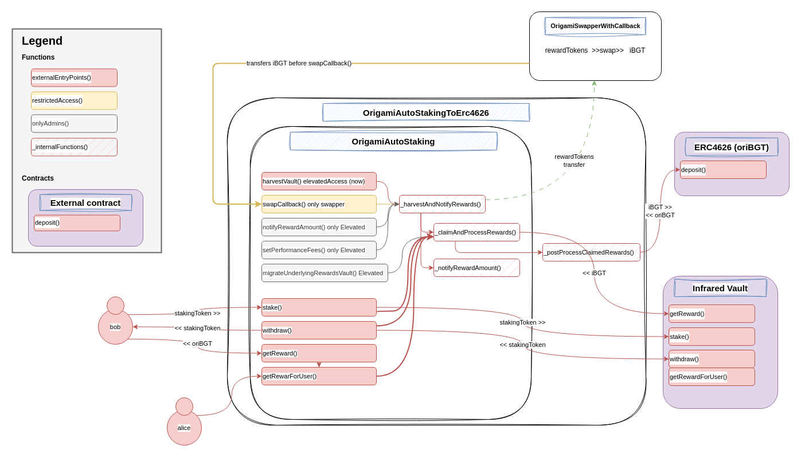

# Origami - AutoStaking security review

A time-boxed security review of **Origami AutoStaking** for [**Origami**](https://x.com/origami_fi), with a focus on smart contract security.

Author: [**Jacopod**](https://twitter.com/jacolansac), an independent security researcher.
Read [past security reviews](https://github.com/JacoboLansac/audits/blob/main/README.md).

## Findings Summary


| Finding | Risk | Description | Response |
| :--- | :--- | :--- | :--- |
| [[M-1]](<#m-1-if-oribgt-is-paused-users-cannot-withdraw-their-principal-or-claim-rewards-from-autostaking-vaults>) | Medium | If oriBGT is paused, users cannot withdraw their principal or claim rewards from AutoStaking vaults | ✅ Fixed |
| [[L-1]](<#l-1-claiming-rewards-reverts-if-one-of-the-reward-tokens-doesnt-return-boolean-on-transfer>) | Low | Claiming rewards reverts if one of the reward tokens doesn't return boolean on transfer | ✅ Fixed |
| [[L-2]](<#l-2-the-function-migrateunderlyingrewardsvault-gives-a-significant-power-to-the-contract-owner>) | Low | The function `migrateUnderlyingRewardsVault()` gives a significant power to the contract owner | ✅ Fixed |


Some informational issues are at the bottom of the report, not worth including in the table. 

## Disclaimer

A smart contract security review can never verify the complete absence of vulnerabilities. This is a time and
resource-bound effort to find as many vulnerabilities as possible, but there is no guarantee that all issues will be found.
A security researcher holds no
responsibility for the findings provided in this document. A security review is not an endorsement of the underlying
business or product and can never be taken as a guarantee that the protocol is bug-free. This security review is focused
solely on the security aspects of the Solidity implementation of the contracts. Gas optimizations are not the main
focus, but significant inefficiencies will also be reported.

## Risk classification

| Severity           | Impact: High | Impact: Medium | Impact: Low |
| :----------------- | :----------: | :------------: | :---------: |
| Likelihood: High   |   Critical   |      High      |   Medium    |
| Likelihood: Medium |     High     |     Medium     |     Low     |
| Likelihood: Low    |    Medium    |      Low       |     Low     |

### Likelihood

- **High** - attack path is possible with reasonable assumptions that mimic on-chain conditions and the cost of the
  attack is relatively low to the amount of funds that can be stolen or lost.
- **Medium** - only conditionally incentivized attack vector, but still relatively likely.
- **Low** - has too many or too unlikely assumptions or requires a huge stake by the attacker with little or no
  incentive.

### Impact

- **High** - leads to a significant material loss of assets in the protocol or significantly harms a group of users.
- **Medium** - only a small amount of funds can be lost (such as leakage of value) or a core functionality of the
  protocol is affected.
- **Low** - can lead to unexpected behavior with some of the protocol's functionalities that are not so critical.

### Actions required by severity level

- **High/Critical** - client **must** fix the issue.
- **Medium** - client **should** fix the issue.
- **Low** - client **could** fix the issue.

## Scope

- **Main review:**
  - Start date: `2025-04-24`
  - End date: `2025-05-13`
  - Effective total time: `20 hours`
  - Commit hash in scope:
    - [0b0c5ae1833ad30965909f6f3f405c532a07dd16](https://github.com/TempleDAO/origami/pull/1532/commits/0b0c5ae1833ad30965909f6f3f405c532a07dd16)

- **Mitigation review**
  - Mitigation review delivery date: `2025-05-14`
  - Commit hash:
    - [3d68df9ff83708305e8a606f0de6a65e6893f0b8](https://github.com/TempleDAO/origami/pull/1532/commits/3d68df9ff83708305e8a606f0de6a65e6893f0b8)

### Files in original scope

| Files in scope                                                                       | nSLOC   |
| ------------------------------------------------------------------------------------ | ------- |
| `contracts/factories/staking/OrigamiAutoStakingFactory.sol`                          | 105     |
| `contracts/factories/staking/OrigamiAutoStakingToErc4626Deployer.sol`                | 26      |
| `contracts/factories/swappers/OrigamiSwapperWithCallbackDeployer.sol`                | 7       |
| `contracts/investments/staking/OrigamiAutoStakingToErc4626.sol`                      | 28      |
| `contracts/investments/staking/OrigamiAutoStaking.sol`                               | 198     |
| `contracts/investments/staking/MultiRewards.sol`                                     | 174     |
| **Total**                                                                            | **538** |


## System Overview

Users can stake their tokens into these AutoStaking vaults and their principal is directly staked into Infrared Vaults. 
The system offers a mechanism to reinvest the rewards coming from infrared:
- Rewards in the form of iBGT tokens are invested into oriBGT (an ERC4626 vault that continuously compounds iBGT)
- Other reward tokens can be handled in two ways:
  - In *SingleReward* mode, the other reward tokens are transferred to the OrigamiSwapperWithCallback, which swaps them for iBGT, which is transferred back to the AutoStaking vault, to then be deposited in oriBGT. 
  - In *MultiReward* mode, the other reward tokens are directly distributed among the depositors

To streamline the deployment of these AutoStaking vaults, an AutoStaking factory is implemented as well. 


## Architecture high-level review

The overall architecture is very clean with a clear focus on security and composability with future modules of the Origami ecosystem. The test suite is very extensive and all interfaces and functions have proper documentation. 

### AutoStaking vault architecture
- The AutoStaking vault inherits the MultiRewards contract inspired by Infrared rewards management, with some custom overrides to hooks like `onStake()`, `onWithdraw()`, etc. 
- The AutoStakingToErc4626 is an AutoStaking vault with the custom processing of the rewards described above (depositing iBGT in the oriBGT vault for autocompounding. 

Here is a rough diagram of how the AutoStaking vault integrates with other components:



### AutoStaking factory deployment strategy
The AutoStakingFactory keeps track of the AutoStaking vaults deployed, linked to staking assets, and the corresponding swappers. It also manages configuration of this deployment process. To register a new vault, the factory deploys a new SwapperWithCallback (so that balances are not mixed up between different vaults in the swapper), and the AutoStakingVault. During this vault registration, the vault and the swapper are configured with the necessary elevatedAccess permissions.

Below is a simplified illustration of the deployment process:


# Findings


## Critical risk

None.

## High risk

None.

## Medium risk

### [M-1] If oriBGT is paused, users cannot withdraw their principal or claim rewards from AutoStaking vaults

As seen in the [AutoStaking vault architecture diagram](#autostaking-vault-architecture), the collection and deposit of iBGT rewards into oriBGT is done automatically as part of all the main external functions: 
- `stake()`
- `withdraw()`
- `getReward()`
- `harvestVault()`
- etc

This is because all those functions call the internal function `_postProcessClaimedRewards()`: 

```solidity
contract OrigamiAutoStakeToErc4626 {
    // ...

    function _postProcessClaimedRewards() internal override returns (uint256 primaryRewardTokenAmount) {
        uint256 rewardBalance = underlyingPrimaryRewardToken.balanceOf(address(this));
        IERC4626 primaryRewardToken4626 = IERC4626(address(primaryRewardToken));
        if (rewardBalance > 0) {
            // @audit this line reverts if oriBGT is paused
>>>         primaryRewardTokenAmount = primaryRewardToken4626.deposit(rewardBalance, address(this));
        }
    }
}
```

Note: in the above code, `primaryRewardToken4626` would be `oriBGT`. 

In the undesirable circumstance that oriBGT is paused, the `oriBGT.deposit()` transaction reverts. This means that all those external functions in the AutoStaking vault would revert as well. It does make sense that new deposits into the AutoStaking are not permitted. However:
- Users should be able to withdraw their principal, so the `withdraw()` function should not revert even if oriBGT paused.
- Users should be able to collect the already accrued oriBGT rewards. So, `getReward()` should not revert as well if oriBGT is paused. 

#### Mitigation
Proposed solutions:
- Checking if oriBGT is paused before depositing
- A toggle parameter (example `bypassOriBGTdeposits`) that admins can toggle to bypass the oriBGT deposits. With this, if oriBGT is paused, admins can bypass the deposit and so that withdrawals/rewardsClaims would be possible.

#### Team response: fixed
Fixed in [48dee5018b8eb7e8349b2509e457550ce032d171](https://github.com/TempleDAO/origami/commit/48dee5018b8eb7e8349b2509e457550ce032d171)

The team added a toggle config so that the oriBGT deposit can be bypassed. 

-----------------

## Low risk

### [L-1] Claiming rewards reverts if one of the reward tokens doesn't return boolean on transfer

The function `MultiRewards.getRewardForUser()` transfers rewards to the `_user` of all reward tokens configured. This function has a dedicated mechanism to bypass weird ERC20 reward tokens that fail on transfers or that consume too much gas. This mechanism consists in encapsulating the `transfer()` external call with a `try/catch` block:

```solidity
    function getRewardForUser(address _user)
        public
        override 
        nonReentrant
        updateReward(_user)
    {
        onReward();
        uint256 len = rewardTokens.length;
        for (uint256 i; i < len; i++) {
            address _rewardsToken = rewardTokens[i];
            uint256 reward = rewards[_user][_rewardsToken];
            if (reward > 0) {
                // Skip any reward tokens which fail on transfer,
                // so the rest can be claimed still
                // Limit the gas to 200k to avoid potential gas DoS for dodgy reward tokens
>>>             try IERC20(_rewardsToken).transfer{gas: 200_000}(_user, reward) {
                    rewards[_user][_rewardsToken] = 0;
                    totalUnclaimedRewards[_rewardsToken] -= reward;
                    emit RewardPaid(_user, _rewardsToken, reward);
                } catch {
                    continue;
                }
            }
        }
    }
```

Unfortunately, the `try/catch` block only catches if the external call itself fails. However, it does not catch any other reverts happening in the context of the AutoStaking contract. For example, if the external call goes through, but the output expected by the IERC20 interface doesn't match the received data, the transaction will revert. 

More specifically, `IERC20.transfer()` expects a `bool` return. Some ERC20 tokens do not return a boolean on transfer. This will cause a revert because the output doesn't match the expected boolean by the interface. 

Not returning a boolean on transfers is not considered the norm, but it is used by some widely used tokens like USDT or BNB. 

#### Impact: low

If a reward token doesn't return a boolean as the IERC20 interface expects, claiming rewards via `getRewardForUser()` will revert. However, the situation is not irreversible, as the team could remove the reward token from the configs, and everything would be back to normal. Also, the likelihood of having to deal with such a non-standard reward token is low. 

#### Mitigation

- Use SafeTransfer lib 
- Use a low-level call with the same checks as SafeTransfer lib. This is the approach followed by Infrared. 

#### Proof of Code

Here is a standalone example of a try/catch not catching a weird ERC20 token that doesn't comply with the IERC20 standard and doesn't return a boolean on `transfer()`:

```solidity
// SPDX-License-Identifier: UNLICENSED
pragma solidity ^0.8.13;

import {Test, console} from "forge-std/Test.sol";
import {IERC20} from "src/interfaces/IERC20.sol";
import {SafeERC20} from "lib/openzeppelin-contracts/contracts/token/ERC20/utils/SafeERC20.sol";

contract AnnoyingERC20 {
    function transfer(address to, uint256 amount) external {
        // IERC20 expects a bool as return value.
        // But this weird ERC20 returns nothing (like USDT, BNB, OMG)
    }
}

contract AnnoyingERC20Test is Test {
    using SafeERC20 for IERC20;
    AnnoyingERC20 annoyingToken;

    function setUp() public {
        annoyingToken = new AnnoyingERC20();
    }

    function test_tryCatchRevert() public {
        // try catch only catches the exception happening on the external call.
        // If the external call goes through, but the return value is not as expected,
        // an EVM revert will happen, but it won't be caught by the try-catch block 
        // because the external call has already finished
        // In this example, the annoying token doesn't return a bool as expected by IERC20.transfer()
        try IERC20(address(annoyingToken)).transfer(address(0x123), uint256(1234)) {
            console.log("try");
        } catch {
            console.log("catch");
        }
    }
}
```

#### Team response: fixed
Fixed in [7ed72b958b8269ae5ca4ef7b2ed69cc7a9727c9e](https://github.com/TempleDAO/origami/commit/7ed72b958b8269ae5ca4ef7b2ed69cc7a9727c9e), using a similar implementation to Infrared and SafeErc20 library.


### [L-2] The function `migrateUnderlyingRewardsVault()` gives a significant power to the contract owner
The Origami team put in place a mechanism to migrate all the staked funds from the underlying Infrared vault to another one, in case Infrared deprecates the underlying vault used by an AutoStaking vault. 

However, this means that the team also has the power to deploy a new fake vault, and migrate all staked assets from the original InfraredVault to the fake one.

```solidity
    /// @inheritdoc IOrigamiAutoStaking
    function migrateUnderlyingRewardsVault(IMultiRewards newRewardsVault) external override onlyElevatedAccess {
        // ...

        // Remove approvals from the old vault, set to max on the new
        IERC20(stakingToken_).safeApprove(address(oldRewardsVault), 0);
        IERC20(stakingToken_).safeApprove(address(newRewardsVault), type(uint256).max);

        // withdraw from the old => stake in the new
>>>     oldRewardsVault.withdraw(stakedBalance);
>>>     newRewardsVault.stake(stakedBalance);

        // ...

        _rewardsVault = newRewardsVault;
    }
```

Even though I understand the reasons for doing this, and I trust the Origami's team, this is something that should be pointed out. 

#### Impact: low
- Probability: very low. It requires a compromised multisig or a malicious team
- Damage: high: users can lose all of their principal

#### Suggested fix:
Remove this function and let the users migrate their funds (worse UX, but requires less trust on the protocol).

#### Team Response: fixed
Fixed in [5fc775acc5b2f6c65c94883aab84d1173b8a62ef](https://github.com/TempleDAO/origami/commit/5fc775acc5b2f6c65c94883aab84d1173b8a62ef)

The team responsibly removed this function, and the protocol cannot migrate funds on behalf of users anymore.


## Informational

### [I-1] If the proposed vault owner doesn't accept, the AutoStakingFactory cannot propose a new owner

When registering a new vault, it is initially deployed with the `AutoStakingFactory` as the owner. Then the vault does some owner-only operations, and then it proposes a new owner:

```solidity
    function registerVault(
        address asset_,
        address rewardsVault_,
        uint256 performanceFeeBps_,
        address overlord_,
        address[] calldata expectedSwapRouters_
    ) external override onlyElevatedAccess returns (IOrigamiAutoStaking deployedVault) {
        
        // ... 

        OrigamiAutoStakingToErc4626 vault = OrigamiAutoStakingToErc4626Deployer(vaultDeployer).deploy({
>>>         owner: address(this),
            stakingToken: asset_,
            rewardsVault: rewardsVault_,
            performanceFeeBps: performanceFeeBps_,
            feeCollector: feeCollector,
            rewardsDuration: rewardsDuration,
            swapper: address(swapper)
        });

        // ... 

>>>     vault.proposeNewOwner(owner);
        emit VaultCreated(address(vault), asset_, address(swapper));
        return vault;
    }
```

The issue: if the proposed owner doesn't accept ownership, the AutoStakingFactory cannot propose a new owner. 

#### Impact
This is hardly an issue as the team can simply deploy a new vault. And the probability of this happening is extremely low anyway, as they would always accept the ownership. 

#### Team response: fixed
Despite the low probability and reduced impact, the team implemented a `proposeOwner()` function in the factory so that a new owner could be proposed. 

### [I-2] SafeApprove is deprecated by Openzeppelin
OpenZeppelin has deprecated `safeApprove()` which is used in a couple of places in the AutoStakingFactory. Instead, they recommend using `SafeIncreaseAllowance()`. 

https://github.com/OpenZeppelin/openzeppelin-contracts/blob/566a774222707e424896c0c390a84dc3c13bdcb2/contracts/token/ERC20/utils/SafeERC20.sol#L38

#### Team response
It is safe to use `SafeApprove()` in the cases when going from 0 to a value greater than zero, which is the case in these contracts. No fix needed. 

