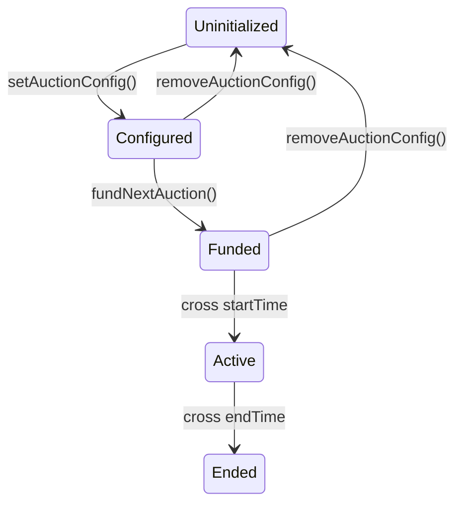

# TempleGold - Spice Auction updates

A time-boxed security review of the updates conducted on the Spice Auctions in TempleGold contracts for [**TempleDAO**](https://templedao.link/),([@templeDAO](https://x.com/templeDAO)) focusing on smart contract security.

Author: [**Jacopod**](https://twitter.com/jacolansac), an independent security researcher.
Read [past security reviews](https://github.com/JacoboLansac/audits/blob/main/README.md).

## Findings Summary

| Finding                                                                                                                                             | Risk | Description                                                                                                                        | Response |
| :-------------------------------------------------------------------------------------------------------------------------------------------------- | :--- | :--------------------------------------------------------------------------------------------------------------------------------- | :------- |


## Disclaimer

A smart contract security review can never verify the complete absence of vulnerabilities. This is a time and
resource-bound effort to find as many vulnerabilities as possible, but there is no guarantee that all issues will be found.

A security researcher holds no
responsibility for the findings provided in this document. A security review is not an endorsement of the underlying
business or product and can never be taken as a guarantee that the protocol is bug-free. This security review is focused
solely on the security aspects of the Solidity implementation of the contracts. Gas optimizations are not the main
focus, but significant inefficiencies will also be reported.

## Risk classification

| Severity           | Impact: High | Impact: Medium | Impact: Low |
| :----------------- | :----------: | :------------: | :---------: |
| Likelihood: High   |   Critical   |      High      |   Medium    |
| Likelihood: Medium |     High     |     Medium     |     Low     |
| Likelihood: Low    |    Medium    |      Low       |     Low     |

### Likelihood

- **High** - attack path is possible with reasonable assumptions that mimic on-chain conditions, and the cost of the
  attack is relatively low compared to the amount of funds that can be stolen or lost.
- **Medium** - only conditionally incentivized attack vector, but still relatively likely.
- **Low** - has too many or too unlikely assumptions, or requires a huge stake by the attacker with little or no
  incentive.

### Impact

- **High** - leads to a significant material loss of assets in the protocol or significantly harms a group of users.
- **Medium** - only a small amount of funds can be lost (such as leakage of value) or a core functionality of the
  protocol is affected.
- **Low** - can lead to unexpected behavior with some of the protocol's functionalities that are not so critical.

### Actions required by severity level

- **High/Critical** - client **must** fix the issue.
- **Medium** - client **should** fix the issue.
- **Low** - client **could** fix the issue.

## Scope

- **Main review:**
  - Start date: `2024-04-21`
  - End date: `2024-04-26`
  - Commit hash in scope:
    - [c5ca284f168a81a3660af67dcdf5290c54a2bf6a](https://github.com/TempleDAO/temple/commit/c5ca284f168a81a3660af67dcdf5290c54a2bf6a)

- **Mitigation review**
  - No issues found, so nothing to be mitigated


### Files in original scope

| Files in scope                                                    | nSLOC   |
| ----------------------------------------------------------------- | ------- |
| protocol/contracts/interfaces/templegold/ISpiceAuction.sol        | 30      |
| protocol/contracts/interfaces/templegold/ISpiceAuctionFactory.sol | 8       |
| protocol/contracts/templegold/SpiceAuction.sol                    | 327     |
| protocol/contracts/templegold/SpiceAuctionFactory.sol             | 73      |
| **Total**                                                         | **438** |

Note: The specific scope was only the Pr with the updates, but for the sake of security, all components of the contracts affected by the updates were reviewed.


## System overview

The Spice Auctions are smart-contract based auctions where TempleDAO can auction an `auctionToken` in exchange for a `bidToken`. The auctions are time-bounded, and after they are finished, the bidders can claim their share of the auctioned token. 

The aim of these auctions is to collect back TGLD (TempleGold tokens) in exchange for some "spice" tokens that the TempleDAO treasury can offer. In this case the auctioToken and bidToken would be the spice token, TempleGold respectively. However, the system also allows TempleDAO to list TGLD in exchange for other spice tokens. 

## Architecture high-level review

A spice auction factory contract deploys Spice auction contracts using the OZ cloning library. Inside each Spice Auction contract, each epoch can have different configurations, different amounts of auctioned tokens. 

TGLD is a non transferrable token, that only whitelisted addresses can transfer or receive. For the system to work, it is necessary that the spice auctions are whitelisted. 

When users bid, the bidTokens are directly transferred to a receiver account, so the bid tokens are never held in the contract's balance. Only the auctioned tokens are.

There are permissioned mechanisms in place for:
- change configurations of an auction before it has been funded
- recover auctioned tokens when there are no bids 


### Valid auction states and state-transitions (for N>0)



### Attributes that define each auction state:

- **Uninitialized** (not configured): 
    - `config.duration=0`
- **Configured**:
    - `config.duration > 0`
    - `epoch.startTime = 0`
- **Funded**: 
    - `epoch.startTime > 0`
    - `block.timestamp < epoch.startTime`
- **Active**:
    - `block.timestamp > epoch.startTime`
    - `block.timestamp < epoch.endTime`
- **Ended**:
  - `block.timestamp > epoch.endTime`
  - `epoch.endTime > 0`


------------

# Findings

## High risk 

None

## Medium risk 

None

## Low risk

None 

## Informational

### [I-1] The waitPeriod of epochId==1 is used in two auction starts

When calling `fundNextAuction()`, the function `_checkWaitPeriod()` is called to check the validity of the `startTime` according to the wait period configured:

```solidity
    function fundNextAuction(uint256 amount, uint128 startTime) external {

        // ...

        // we check that last auction has ended before updating the amount of tokens
        uint256 epochId = _currentEpochId;
        if (!epochs[epochId].hasEnded()) { revert AuctionActive(); }

        // auction config for next auction must be set
        uint256 nextEpochId = epochId + 1;
        SpiceAuctionConfig storage config = auctionConfigs[nextEpochId];
        if (config.duration == 0) { revert MissingAuctionConfig(nextEpochId); }
        if (amount < config.minimumDistributedAuctionToken) { revert NotEnoughAuctionTokens(); }
>>>     _checkWaitPeriod(epochId, startTime, config);

        // ...
    }

    /// @dev epochId is the current epoch ID
    function _checkWaitPeriod(
        uint256 epochId,
        uint256 checkTimestamp,
        SpiceAuctionConfig storage nextAuctionConfig
    ) private view {
        /// check enough wait period since last auction
>>>     if (epochId > 0) {
            // `_currentEpochId` is still last epoch
            EpochInfo memory lastEpochInfo = epochs[epochId];
            /// use waitperiod from last auction config
            uint64 _waitPeriod = auctionConfigs[epochId].waitPeriod;
>>>         if (lastEpochInfo.endTime + _waitPeriod > checkTimestamp) { revert WaitPeriod(); }
        } else {
            /// For first auction
>>>         if (_initializeTimestamp + nextAuctionConfig.waitPeriod > checkTimestamp) { revert WaitPeriod(); }
        }
    }
```

There is a small nuance, which is that the wait period of epochId=1 is used twice:

- When `fundNextAuction()` is called and `epochId==0`:
  - `_checkWaitPeriod()` goes into the second branch of the above if-statement 
  - and therefore it uses the `waitPeriod` from `nextAuctionConfig`, which is epochId=1.
- When `fundNextAuction()` is called and `epochId==1`:
  - `_checkWaitPeriod()` goes into the first brach of the above if-statement
  - and therefore it uses the `waitPeriod` from the current one (`auctionconfigs[epochId]`, and `epochId==1`)

There is no risk, and therefore it is only an informational so that the team is aware when configuring the wait period of the first auction. 