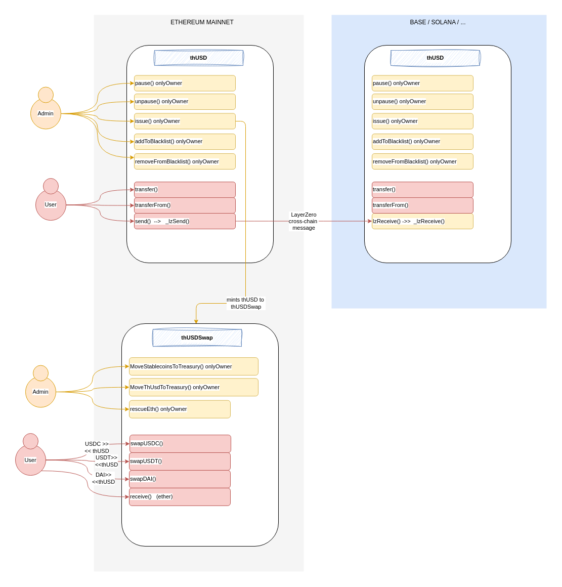

_Prism delivers specialized security solutions for blockchain and AI companies. We go beyond traditional audits, offering bespoke penetration testing, adversary simulation, and AI security solutions to meet the needs of every client. With tailored services and best-in-class expertise, we safeguard your business against the most sophisticated threats, allowing you to focus on innovation._

Read more: [prismsec.xyz](http://prismsec.xyz/)

<br>
<br>
<br>
<br>

# Tharwa Stage 0 - security review
A time-boxed security review of **THARWA - Stage 0 contracts** for [**Tharwa Finance**](https://tharwa.finance/), with a focus on smart contract security, conducted by [prismsec.xyz](http://prismsec.xyz/).

Lead Security Researcher: [**Jacopod**](https://twitter.com/jacolansac), an independent security researcher.
Read [complete portfolio](https://github.com/JacoboLansac/audits/blob/main/README.md).

## 1.1 - Findings Summary

| Finding                                                                                                                                             | Risk   | Description                                                                                                                          | Response |
| :-------------------------------------------------------------------------------------------------------------------------------------------------- | :----- | :----------------------------------------------------------------------------------------------------------------------------------- | :------- |
| [[M-1]](<#m-1-sending-tokens-cross-chain-while-the-oft-tokens-are-paused-leads-to-users-losing-their-funds-permanently>)                               | Medium | Sending tokens cross-chain while the OFT tokens are paused leads to users losing their funds permanently                                | ✅ Fixed  |
| [[L-1]](<#l-1-if-moving-stablecoins-from-the-thusdswap-to-the-treasury-reverts-for-one-of-the-stablecoins-all-three-will-be-stuck-in-the-contract>) | Low    | If moving stablecoins from the thUSDSwap to the treasury reverts for one of the stablecoins, all three will be stuck in the contract | ✅ Fixed  |


##  1.2 - Disclaimer

A smart contract security review can never verify the complete absence of vulnerabilities. This is a time and
resource-bound effort to find as many vulnerabilities as possible, but there is no guarantee that all issues will be found. 
This security review does not guarantee against a hack. Any modifications to the code will require a new security review.

A security researcher holds no
responsibility for the findings provided in this document. A security review is not an endorsement of the underlying
business or product and can never be taken as a guarantee that the protocol is bug-free. This security review is focused
solely on the security aspects of the Solidity implementation of the contracts. Gas optimizations are not the primary
focus, but significant inefficiencies will also be reported.

## 1.3 - Risk classification

| Severity           | Impact: High | Impact: Medium | Impact: Low |
| :----------------- | :----------: | :------------: | :---------: |
| Likelihood: High   |   Critical   |      High      |   Medium    |
| Likelihood: Medium |     High     |     Medium     |     Low     |
| Likelihood: Low    |    Medium    |      Low       |     Low     |

### 1.3.1 - Likelihood

- **High** - attack path is possible with reasonable assumptions that mimic on-chain conditions, and the cost of the
  attack is relatively low compared to the amount of funds that can be stolen or lost.
- **Medium** - only conditionally incentivized attack vector, but still relatively likely.
- **Low** - has too many or too unlikely assumptions, or requires a huge stake by the attacker with little or no
  incentive.

### 1.3.2 - Impact

- **High** - leads to a significant material loss of assets in the protocol or significantly harms a group of users.
- **Medium** - only a small amount of funds can be lost (such as leakage of value) or a core functionality of the
  protocol is affected.
- **Low** - can lead to unexpected behavior with some of the protocol's functionalities that are not so critical.

### 1.3.3 - Actions required by severity level

- **High/Critical** - client **must** fix the issue.
- **Medium** - client **should** fix the issue.
- **Low** - client **could** fix the issue.

## 1.4 - Scope

- **Preliminary manual review:**
  - Start date: `2025-06-03`
  - End date: `2025-06-05`
  - Commit hash in scope: [6ae61ddcf78bb2e446d188a216eac4fbf3188814](https://github.com/tharwa-finance/contracts-v0/commit/6ae61ddcf78bb2e446d188a216eac4fbf3188814)

- **Mitigation review**
  - Mitigation review delivery date: `2025-06-06`
  - Commit hash: [01e98827917ad2e065c72cec4b034bc0d3345484](https://github.com/tharwa-finance/contracts-v0/commit/01e98827917ad2e065c72cec4b034bc0d3345484)

### 1.4.1 - Files in the original scope

| Files in scope                              | nSLOC |
| ------------------------------------------- | ----- |
| `contracts-v0/stableswap/src/thUSDSwap.sol` | 116   |
| `contracts-v0/thUSD/contracts/thUSD.sol`    | 54    |
| `contracts-v0/TRWA/contracts/TRWA.sol`      | 94    |
| **Total**                                   | 264   |


## 1.5 - Context

### 1.5.1 - Protocol Overview

In its Stage 0, Tharwa consists only of a stable coin `thUSD.sol` that can be minted in exchange for other more established stablecoins (DAI, USDC, USDT). This exchange happens in the `thUSDSwap.sol` contract. The `thUSD` token is a cross-chain token leveraging [*LayerZero*'s](https://layerzero.network/) OFT standard. Initially, `thUSD` will only be minted on the Ethereum mainnet, but the team plans to deploy it on other EVM chains, such as [Base](https://www.base.org/), and non-EVM chains, like [Solana](https://www.base.org/).

Lastly, there is a governance token (`TRWA.sol`) which is also a cross-chain token inheriting the OFT standard.


### 1.5.2 - Architecture high-level review

- The contracts are well-written, and the logic is well-structured. 
- The architecture is straightforward, which is always good for security.
- Since `thUSD` and `TRWA` are OFT tokens, special attention has been paid to the non-atomic nature of cross-chain transactions. 
- Both OFT contracts inherit `Pausable`, which can lead to some niche scenarios in cross-chain communication (see issue M-1).

The diagram below illustrates the different components around the `thUSD` token. The `TRWA` is excluded from the diagram as it would be the same:




# 2 - Findings

## 2.1 - High risk

*No findings found.*

## 2.2 - Medium risk

### [M-1] Sending tokens cross-chain while the OFT tokens are paused leads to users losing their funds permanently

Both OFT tokens (`thUSD` and `TRWA`) inherit both the OFT standard from LayerZero and the `Pausable` from OpenZeppelin. 

In a normal scenario, when tokens are sent cross-chain using `OFT.send()`, the tokens are burned in the origin chain and then minted in the destination chain. Minting tokens uses the `ERC20._update()` function, which is overridden in `thUSD` and `TRWA` with the `whenNotPaused` modifier:

```solidity
>>> function _update(address from, address to, uint256 value) internal override whenNotPaused {
        if (isUserBlacklisted(from)) {
            revert UserBlacklisted(from);
        }
        if (isUserBlacklisted(to)) {
            revert UserBlacklisted(to);
        }
        super._update(from, to, value);
    }
```

On the other hand, the `OFT.send()` function doesn't have such a modifier, so sending tokens cross-chain is possible even if the origin and destination chains are paused. 

If users try to send tokens cross-chain when the destination chain is paused, the `whenNotPaused` modifier will revert in the destination chain. However, due to the non-atomic nature of cross-chain messages, the destination chain is unable to roll back the transaction that has already been minted in the origin chain. This means that the tokens are successfully burned in the origin chain, but never minted in the destination chain. The user loses the funds that they attempted to transfer.

#### Impact: medium

*If users attempt to **send** tokens cross-chain when the destination chain is **paused**, the users will **loose** the transferred tokens.*

- **Probability**: *low*, as the contracts are not intended to be paused except in the event of an exploit or emergency. 
- **Severity**: *high*, as the users lose the funds that they attempted to send cross-chain. 

#### Suggested mitigation

- The fastest fix: override the `OFT.send()` function adding the `whenNotPaused` modifier. Note, however, that the described scenario is also possible even with this modifier if the origin chain is not paused but the destination chain is. Therefore, it would require an orchestrated method of pausing transactions across all chains, which is not a trivial task.
- The most straightforward and most secure fix is to remove the Pausable functionality from the OFT tokens. It is suggested to make only specific target functions pausable, such as the swap functions from the `thUSDSwap` contract or future protocol contracts (e.g., borrowing, lending). 

#### Team response: fixed

The team removed the `Pausable` feature from both OFT contracts. 


## 2.3 - Low risk

### [L-1] If moving stablecoins from the thUSDSwap to the treasury reverts for one of the stablecoins, all three will be stuck in the contract

When a user swaps stablecoins (USDC, USDT, DAI) for thUSD, the stablecoins are transferred to the thUSDSwap contract balance and remain there until an admin calls `MoveStablecoinsToTreasury()`. When this function is called, the three stablecoins are transferred at the same time to the treasury:

```solidity
    function MoveStablecoinsToTreasury() external onlyOwner {
        address[3] memory tokens = [dai, usdc, usdt];
        uint256[3] memory transferredAmounts;

        for (uint256 i = 0; i < tokens.length; i++) {
            IERC20 token = IERC20(tokens[i]);
            uint256 balance = token.balanceOf(address(this));
            if (balance > 0) {
>>>             token.safeTransfer(treasury, balance);
                transferredAmounts[i] = balance;
            }
        }

        emit StablecoinsMovedToTreasury(
            transferredAmounts[0],
            transferredAmounts[1],
            transferredAmounts[2]
        );
    }
```

As can be seen, the three tokens are coupled, as the admin cannot choose to transfer one of them individually; all three must be transferred together. 

If the transfer of any of the three tokens fails, the entire transaction will be reverted. Some (unlikely) scenarios that could make these transactions revert are:
- USDC / USDCT blacklisting the treasury or the thUSDSwap contracts
- Permanent **pause** or sunset of any of the three stablecoins (due to some massive depeg, or lack of backing reserves). 

In those unlikely scenarios, if one of them cannot be transferred, the funds from the other two stablecoins would also become stuck in the thUSDSWap contract.

#### Impact: low

A failure to transfer one of the stablecoins causes the other two also to remain locked in the thUSDSwap contract.

- **Probability**: *very low*
- **Impact**: *Medium*, as only the funds currently in the `thUSDCSwap` are affected; any funds that have already been transferred are not. 

#### Suggested mitigation

The primary idea is to split the transfers from the thUSDSwap to the treasury into separate transactions, or to allow the admin to choose which tokens to transfer. 

However, I suggest a simpler architecture, where the funds are transferred directly to the treasury within the swap functions. See an example below for one of the swap functions:

```diff
    function swapUSDT(uint256 usdtAmount) external nonReentrant {
        if (usdtAmount == 0) {
            revert AmountZero();
        }

        // USDT is also 6 decimals so we need to scale it up by 12
        uint256 thAmount = usdtAmount * SCALING_FACTOR;
        if (IERC20(thUSD).balanceOf(address(this)) < thAmount) {
            revert InsufficientLiquidity();
        }

-       IERC20(usdt).safeTransferFrom(msg.sender, address(this), usdtAmount);
+       IERC20(usdt).safeTransferFrom(msg.sender, treasury, usdtAmount);
        IERC20(thUSD).safeTransfer(msg.sender, thAmount);

        emit SwapUSDTForThUSD(msg.sender, usdtAmount, thAmount);
    }
```

In this way, the stablecoins don't have to be held in the `thUSDSwap` contract, and there is no need to move them to the treasury periodically. In this way, it is also possible to remove the `MoveStablecoinsToTreasury()` function completely. Instead, it is recommended to have a general `rescueERC20()` function, which allows for rescuing any token sent to the contract by mistake. 

#### Team response: fixed

The team followed the suggestion, and the stablecoins are transferred directly to the treasury. A generic function to rescue ERC20 tokens was added.

## 2.4 - Informational issues

- In `thUSDSwap.swapUSDC()`, the variable `thAmount` is declared twice using the same expression, while none of the factors differ between the two declarations: `thAmount = usdcAmount * SCALING_FACTOR;`. The second declaration can therefore be removed.

- In `TRWA`, the error TradingNotOpen() is not used. It can be removed. 


